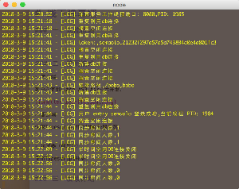

# 线下弹幕墙

### 一、使用场景

1、ACG 等下线活动

2、电影院播放弹幕电影。

3、公司年会助兴

__ 参与活动用户可以扫码进入发弹幕页面，参与互(吐)动(槽) __

### 二、使用技术

> 客户端 使用Flash Air 开发

依赖组件库 <https://github.com/samao/LazyDodu>

功能包括合成本地资源文字，图片，视频，摄像头，并连接后端websocket服务器。最终合成图像投屏到第二屏。使用Flash air开发可以做到夸平台，window和mac共用一套代码。

> 服务端 使用`Typescript`开发, 涉及 `Node.js`, `Express`, `Mongodb`

功能包括`http + websocket` 弹幕服务，敏感词系统。web前端数据支持，`pug`模板渲染。数据库采用`mongodb`，服务器框架为`express`，使用cluster充分利用服务器cpu。

> 浏览器（前后台）使用`Typescript`开发。涉及 `React.js`,`jQuery`

+ 产品展示前后台

主要用于之后的推广宣传，用户注册，用户自定义活动，自定义敏感词。

+ Web端发送弹幕

用户扫码进入，发送弹幕，参与活动。

### 三、后续计划

2018.1.6由于精力问题，暂缓开发进度。目前完成度，前端功能50%，客户端70%，后端90%。后续还会不间断开发。后续弹幕发送还会接入微信公众号和小程序。前端框架会逐渐进化到react.js

### 四、开源免责

如果有团体或者个人对项目感兴趣，欢迎使用或者进行二次开发。

### 五、联系方式

